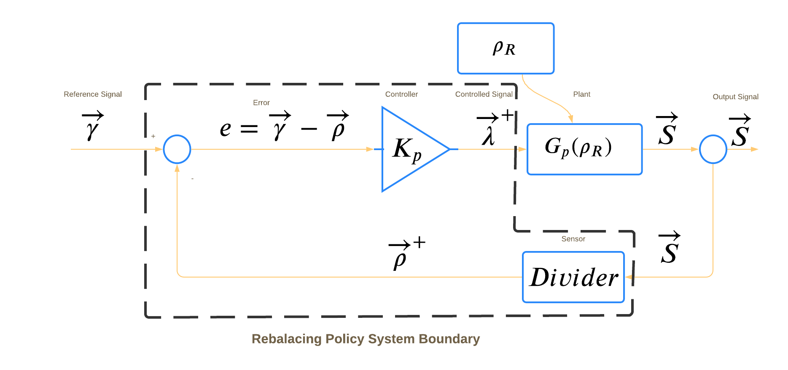
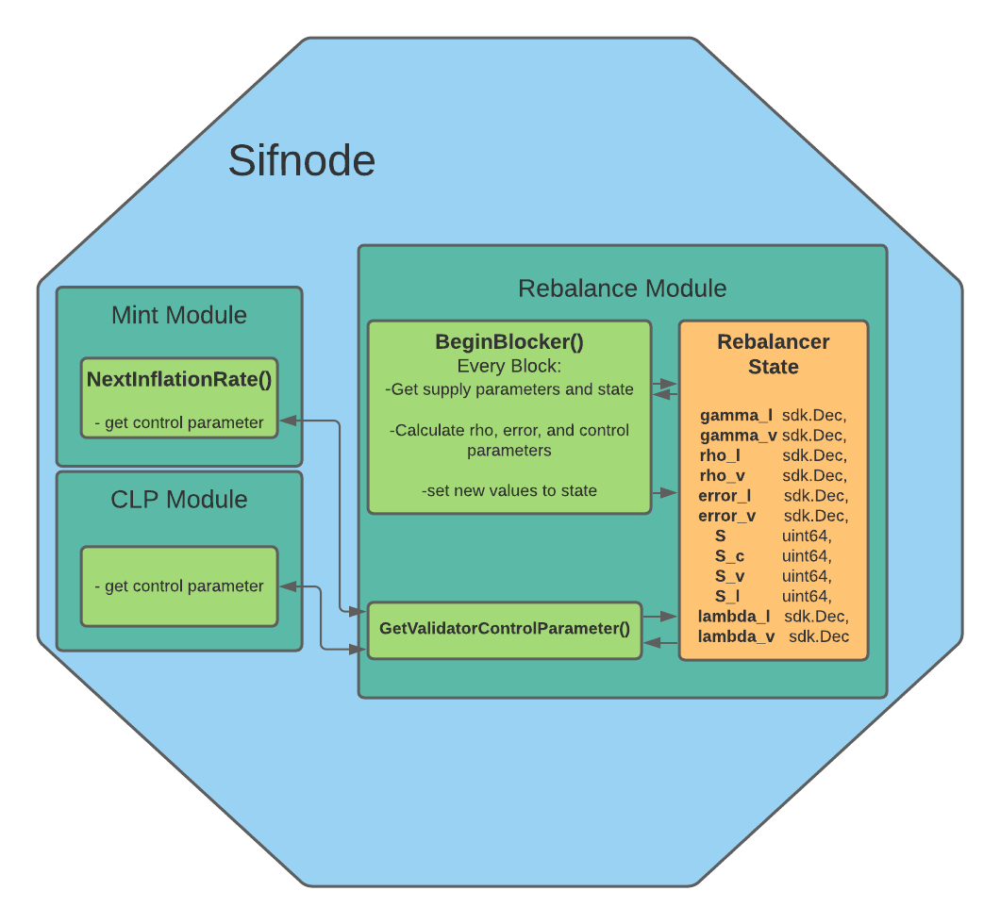

# **Sifchain Rebalance Module**

## Changelog
-First Draft: Austin Haines 12/07/2020


## Context
The Rebalance module outlined below is responsible for executing the rebalancing logic necessary for Sifchain's Dynamic Reward Rebalancing Policy outlined by Blockscience: https://hackmd.io/@shrutiappiah/r1itFRrPv. Implementation guide provided by Blockscience: https://hackmd.io/@mbarlin/H1AucYziw. The goal of the Rebalancing Policy is to control rewards between Sifchain's Validator subsystem, Liquidity Pool subsystem, and any future subsystems in order to maintain
balanced and equivalent revenue. This will prevent validators from jumping to the Liquidity Pool subsystem seeking higher rewards and vice versa. 

The module takes as inputs the observed Rowan supplies in each subsystem, the circulating economy, and the total supply of Rowan. Each subsystem's supply is compared to the total supply to obtain ratios: `rho`. These ratios are then compared with target ratios: `gamma` to obtain `error` values. These `error` values are then used to compute control parameters: `lambda` for each subsystem. Each `lambda` is a subsystem specific coefficient designed to temper its rewards toward balance with the other subsystems. The module provides hooks for the subsystems to retrieve these `lambda` values for use in their reward calculations.





## Types

**Internal Global State:**

**Rebalancer**
The Rebalancer struct holds all state variables required for the Rebalancing Policy.
```golang
package types

import (
	"fmt"

	sdk "github.com/cosmos/cosmos-sdk/types"
)

type Rebalancer struct {
	gamma_l     sdk.Dec `json:"gamma_l" yaml:"gamma_l"`     // Target in liquidity subsystem, updated in governance module
    gamma_v     sdk.Dec `json:"gamma_l" yaml:"gamma_l"`     // Target in validator subsystem, updated in governance module
    rho_l       sdk.Dec `json:"rho_l" yaml:"rho_l"`         // Ratio of tokens in liquidity subsystem, computed within module
    rho_v       sdk.Dec `json:"rho_v" yaml:"rho_v"`         // Ratio of tokens in validator subsystem, computed within module
    error_l     sdk.Dec `json:"error_l" yaml:"error_l"`     // Error in liquidity subsystem, computed in module
    error_v     sdk.Dec `json:"error_v" yaml:"error_v"`     // Error in validator subsystem, computed in module
    S           uint64  `json:"S" yaml:"S"`                 // Total Rowan in existence
    S_c         uint64  `json:"S_c" yaml:"S_c"`             // Circulating supply, difference from all other token states
    S_v         uint64  `json:"S_v" yaml:"S_v"`             // Tokens locked in validator stake
    S_l         uint64  `json:"S_l" yaml:"S_l"`             // Rowan tokens in liquidity pools
    lambda_l    sdk.Dec `json:"lambda_l" yaml:"lambda_l"`   // Rebalancing coefficent for liquidity subsystem, computed in module
    lambda_v    sdk.Dec `json:"lambda_v" yaml:"lambda_v"`   // Rebalancing coefficent for validator subsystem, computed in module
}

// Divider: Update Rho
func (rebalancer Rebalancer) Rho_Updater() Rebalancer {
    """
    Update all rho partitions by dividing by total supply S
    """

    S = rebalancer.S
    S_l = rebalancer.S_l
    S_v = rebalancer.S_v
    // S_x = rebalancer['S_x']
    
    rebalancer.rho_l = S_l / S
    rebalancer.rho_v = S_v / S
    // rebalancer['rho_x'] = S_x / S
    
    return rebalancer
}

// Difference: Update Error
func (rebalancer Rebalancer) Error_Updater() Rebalancer {
    """
    Update all error terms by subtracting actual from target
    """

    rho_v = rebalancer.rho_v
    gamma_v = rebalancer.gamma_v

    rho_l = rebalancer.rho_l
    gamma_l = rebalancer.gamma_l
    
    rebalancer.error_v = gamma_v - rho_v
    rebalancer.error_l = gamma_l - rho_l
    
    return rebalancer
}

// Error Handler to prevent calculation of new Lambdas if error is small enough
func (rebalancer Rebalancer) Delta_Handler(Rebalancer_Parameter_Set) bool {
          
    error = rebalancer.error_v
    delta = Rebalancer_Parameter_Set.delta
    
    abs_error = np.abs(error)
    
    
    if abs_error < delta:
        return false
    
    else if abs_error >= delta:
        return true
}

}
// Gain: Update Lambda
func (rebalancer Rebalancer) Lambda_Updater(Rebalancer_Parameter_Set) Rebalancer {
    """
    Update all lambda terms with control policy algorithm
    """

    // For validator 
    lambda_v = rebalancer.lambda_v
    error_v = rebalancer.error_v
    K = Rebalancer_Parameter_Set.K
    bound = Rebalancer_Parameter_Set.bound

    if error_v > 0:
        lambda_v = 1 - (K- np.abs(error_v)) / K * (1 - lambda_v)

    else:
        lambda_v = (K - np.abs(error_v)) / K * lambda_v
        
    if lambda_v > 1 - bound:
        lambda_v = 1 - bound

    if lambda_v < bound:
        lambda_v = bound
        
    rebalancer.lambda_v = lambda_v
    
    // For liquidity, exactly same as validator except for _v,
    // so can be one function called X number of subsystems  
    lambda_l = rebalancer.lambda_l
    error_l = rebalancer.error_l
    K = Rebalancer_Parameter_Set.K
    lambdaBound = Rebalancer_Parameter_Set.LambdaBound

    if error_l > 0:
        lambda_l = 1 - (K- np.abs(error_l)) / K * (1 - lambda_l)

    else:
        lambda_l = (K - np.abs(error_l)) / K * lambda_l
        
    if lambda_l > 1 - LambdaBound:
        lambda_l = 1 - LambdaBound

    if lambda_l < LambdaBound:
        lambda_l = LambdaBound
        
    rebalancer.lambda_l = lambda_l

    return rebalancer
}
```

## Parameters
These parameters hold modifiers to the Rebalancing Policy's computation that can be altered through governance.

```golang

// Parameter store keys
var (
	KeyK           		         = []byte("K")              // uint64 Gain controlling update rate of lambda, 1 or greater
	KeyLambdaBound               = []byte("LambdaBound")    // sdk.Dec Small value greater than the precision limit of VM, e.g. 0.001
    KeyDelta                     = []byte("Delta")          // sdk.Dec Smallest value of error to proceed with update computation, e.g. 0.001
    KeyGammaL                    = []byte("GammaL")         // sdk.Dec Target in liquidity subsystem, updated in governance module
    KeyGammaV                    = []byte("GammaV")         // sdk.Dec Target in validator subsystem, updated in governance module
)

```

## Keeper

**keeper.go**
 The main keeper has functions for getting and setting the internal Rebalancer state as well as hooks to retrieve the control parameters for use in the subsystems.

```golang
func (k Keeper) GetRebalancer(ctx sdk.Context) (types.Rebalancer, error) {
    var rebalancer types.Rebalancer
	store := ctx.KVStore(k.storeKey)
	b := store.Get(types.RebalancerKey)
	if b == nil {
		panic("stored rebalancer should not have been nil")
	}

	k.cdc.MustUnmarshalBinaryBare(b, &rebalancer)
	return rebalancer, nil
}

func (k Keeper) SetRebalancer(ctx sdk.Context, rebalancer types.Rebalancer) {
	store := ctx.KVStore(k.storeKey)
	b := k.cdc.MustMarshalBinaryBare(&rebalancer)
	store.Set(types.RebalancerKey, b)
}

func (k Keeper) GetValidatorControlParameter(ctx sdk.Context) (sdk.Dec, error) {
   store := ctx.KVStore(k.storeKey)
	b := store.Get(types.RebalancerKey)
	if b == nil {
		panic("stored rebalancer should not have been nil")
	}

	k.cdc.MustUnmarshalBinaryBare(b, &rebalancer)
	return rebalancer.lambda_v, nil
}

func (k Keeper) GetLiquidityControlParameter(ctx sdk.Context) (sdk.Dec, error) {
    store := ctx.KVStore(k.storeKey)
	b := store.Get(types.RebalancerKey)
	if b == nil {
		panic("stored rebalancer should not have been nil")
	}

	k.cdc.MustUnmarshalBinaryBare(b, &rebalancer)
   return rebalancer.lambda_l, nil
}
```

**abci.go**
In order to keep our control parameters up to date with changes in our subsystems (ie: the Validator subsystem Mint module's NextInflationRate calculation every block) we call our update functions in the Rebalancer module's BeginBlocker. This will ensure that we're always acting on recent and relevant observations.

```golang
func BeginBlocker(ctx sdk.Context, req abci.RequestBeginBlock, k Keeper) {
    // get current rebalancer state
    rebalancer = k.GetRebalancer()
    // get rebalancer params
    Rebalancer_Parameter_Set = k.GetParams(ctx)

    // set gamma's that may have changed through governance
    rebalancer.gamma_l = Rebalancer_Param_Set.GammaL
    rebalancer.gamma_v = Rebalancer_Param_Set.GammaV

    // get supplies
    rebalancer.S = k.supplyKeeper.GetSupply()
    rebalancer.S_v = k.stakingKeeper.TotalBondedTokens())
    rebalancer.S_l = k.clpKeeper.GetLiquiditySupply()

    // calculate rho update
    rebalancer = rebalancer.Rho_Updater()
    // calculate error update
    rebalancer = rebalancer.Error_Updater()
    // check if error is large enough to update lambda
    if rebalancer.Delta_Handler(Rebalancer_Parameter_Set) {
        //update lambda
        rebalancer = rebalancer.Lambda_Updater(Rebalancer_Parameter_Set)
    }
    
    // set new rebalancer state
    k.SetRebalancer(ctx, rebalancer)
}
```